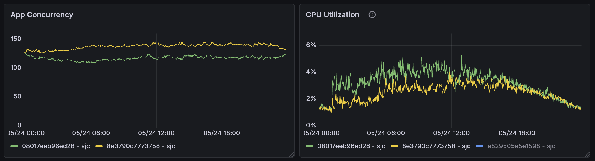
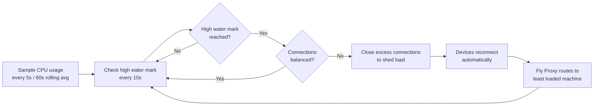

# Scaling

There are several mechanisms in place to maintain optimal **capacity** and **balance** in a production deployment of the Transit Tracker API service. This document details each component, its role, and how it works. For context, this system was designed with ~300 daily active connections subscribed to mostly OneBusAway feeds.

Most of these are specific to deployments on Fly.io, but the same principles apply when hosting at other providers.

## Performance Profile

The Transit Tracker API has a somewhat unique and inconsistent performance profile.

Public transportation service patterns change throughout the day, so there's not a reliable correlation between one connection and its associated CPU usage; more trips to process means higher CPU utilization. This means we can have a significant number of clients subscribed to schedule updates but relatively low CPU usage in the middle of the night, but the same connections with high CPU at rush hour.

Here's a representative of typical CPU util vs connections throughout one day:

This is something to keep in mind as we design an auto-scaling and load-balancing solution.

## Maintaining Capacity

Fly Proxy has a built-in autoscaler which measures demand based on the number of requests, but since most clients communicate with long-lived WebSockets rather than bursty, ephemeral HTTP requests, it doesn't entirely fit our needs. The number of connections is expected to be somewhat stable throughout the entire day, so Fly Proxy would scale up to the same number of machines even if they are severely under-utilized.

We instead use [fly-autoscaler](https://fly.io/docs/launch/autoscale-by-metric/) which lets us derive the number of desired machines based on a Prometheus query &mdash; in our case, CPU usage. This project uses [my forked version](https://github.com/tjhorner/fly-autoscaler) which adds two features:

- Select candidate machines based on process group
- Prioritize machines to scale down based on an additional metric

The autoscaler is deployed as its own Fly app and can be found in [`autoscaler.fly.toml`](../../autoscaler.fly.toml). If you are deploying this for yourself, you'll need to change various details to match your own organization and app names.

It's configured to keep machines under the 6.25% CPU baseline of Fly's `shared-cpu-2x` machines: as a machine nears this limit, the autoscaler will bring another up; if any are underutilized, it will scale down. Machines with the fewest connections are scaled down first to avoid overwhelming other machines when redistributed.

## Maintaining Balance

A problem we run into with long-running connections is that they will "stick" to the machine they're connected to even if a more suitable, less loaded one becomes available. If a machine becomes overloaded, the autoscaler can bring up as many new machines as it wants, but the overloaded machine will stay that way since it retains all of its connections.

To remediate this situation, the service has a load shedding mechanism which keeps track of CPU load and closes excess connections when necessary. It works like this:

This loop is managed by the [ConnectionSheddingService](../../src/schedule/connection-shedding.service.ts) and ensures the autoscaler can safely scale up and down without overwhelming any individual machine.

### Tracking connections

The [ScheduleMetricsService](../../src/schedule/schedule-metrics.service.ts) is responsible for keeping track of how many connections (technically, schedule subscriptions) each machine is handling. The machines communicate and store subscription counts via Redis so there is no direct dependency on Fly.io specifics.

Shedding load only when connections are unbalanced is an important feature to avoid flapping. It is possible for all machines to be overloaded briefly while the autoscaler brings up a new machine, and without this check, the machines would all constantly be shedding load and basically play "hot potato" with the connections, causing poor connectivity for devices and actually *increasing* overall CPU load.
